<!-- Generated by tools/doc_index.py. Do not edit; run `uv run nox -s docs`. -->

# Repo state — the one-read session primer

Every line here is derived; nothing is unique to this file. It exists
so a session orients in one read instead of four.

**Open items (21)** — one file each in `todo/`, most urgent
first. `unassessed` means nobody has ranked it, not that it ranked low:

- **high** — [The graph carries the crop, the span, and the detector](todo/the-graph-carries-the-crop-the-span-and-the-detector.md) — nothing
- **normal** — [A number says how it was founded, and for which machine](todo/a-number-says-how-it-was-founded.md) — nothing
- **normal** — [A ceiling is denominated in the dimension of what it bounds](todo/ceilings-in-the-dimension-they-bound.md) — nothing
- **normal** — [DetectorState dies, and nothing replaces it](todo/detector-state-dies.md) — nothing
- **normal** — [Presentation is a declared channel, not a switch in a widget](todo/presentation-is-a-channel-not-a-switch.md) — nothing
- **normal** — [Rule 6's frontier moves into the execution contract](todo/rule-sixs-frontier-moves-into-the-contract.md) — nothing
- **normal** — [sieve detect collapses into sieve run](todo/sieve-detect-collapses-into-sieve-run.md) — nothing
- **normal** — [The executor stops cutting frames](todo/the-executor-stops-cutting-frames.md) — nothing
- **normal** — [The mutual tier — shared by dependency, not by agreement](todo/the-mutual-tier.md) — nothing
- **normal** — [Warmup is derived, epsilon is a field, cacheable splits fact from policy](todo/warmup-is-derived-not-declared.md) — nothing
- **normal** — [Work units have one anchor and no coefficient table](todo/work-units-have-one-anchor.md) — nothing
- **normal** — [filter_tab.py owns six secrets](todo/filter-tab-many-secrets.md) — nothing structurally
- **normal** — [A position is not a count, and an index belongs to one stream](todo/a-position-is-not-a-count.md) — nothing structurally
- **low** — [Name the fold, and give the combining rule to whoever fixes the strategy](todo/name-the-fold.md) — nothing
- **low** — [Stage is derived from the spec, or declared once — never both](todo/stage-is-derived-or-declared-once.md) — nothing
- **unassessed** — [`slider_to_graph` names a gesture two other budgets now time](todo/slider-to-graph.md) — nothing — the trigger this item was written against ("a parameter control bound to a node") fired, and what is left is a decision about the budget table rather than a panel to build
- **unassessed** — [A budget check gets slower the more of the suite pytest imported](todo/budget-checks-under-ambient-load.md) — nothing — but the first step is a measurement of the mechanism, not a choice among fixes; every option written before 2026-07-28 was written against a cause that turned out not to be the cause
- **unassessed** — [Sessions log how the app was used, and changes are scored against a moving baseline](todo/slow-path-surfacing.md) — nothing — the trigger fired 2026-07-28 when ledger-producers landed (docs/completed-todo/2026.07.28-ledger-producers.md): the resource probe and the pool meters now publish, so there is something to aggregate.
- **unassessed** — [filter_tab.py is eleven jobs in one widget](todo/filter-tab-is-eleven-jobs.md) — nothing structurally — but take it one named responsibility per item, never as one split
- **unassessed** — [One edit is three regions in two files](todo/one-edit-is-three-regions-in-two-files.md) — nothing — scoped to option A on 2026-07-28 after 937ac91 refused option B
- **unassessed** — [Qt-free logic is stranded under gui/](todo/qt-free-logic-under-gui.md) — nothing structurally — but the rework moves the biggest rows on its own terms (rescoped 2026-07-29: this item is the residue, not the plan)

**Deferred (19)** — the trigger is the whole line:

- **normal** — [A kernel that changes the rate](todo/a-kernel-that-changes-the-rate.md) — a decimator somebody needs — the rate arithmetic (output_rate as exact Fraction, input_warmup_frames, the monotone fold) is fully built and reachable by no filter, and building execution for it without a consumer would repeat the GPU machinery's mistake
- **normal** — [The band handlers are one shape said five times](todo/the-band-handlers-are-one-shape-said-five-times.md) — detector-state-dies landing, which is what decides whether there are still five shapes to collapse
- **unassessed** — [Sink writers, and the replicate status that reads them](todo/sink-writers.md) — the first filter that emits a TableSpec (a detector producing coordinates), or materialization landing and needing somewhere for a compacted array
- **unassessed** — [Parity comparison finding](todo/parity-comparison-finding.md) — a seated session with the v1 checkout — v1 is a sibling repo no agent can reach and no headless run can drive, so the pending decision is what that session is for: a live two-GUI side-by-side, or one throwaway v1 run that dumps its count/gate series as a fixture a headless harness then compares against forever (recommended)
- **unassessed** — [Annotation spans, and the accuracy feedback they unlock](todo/annotation-spans.md) — a detector whose output is worth correcting by hand, or a labelling task that needs ground truth before one exists
- **unassessed** — [Application config, and where the boundary with Preferences falls](todo/application-config.md) — the first setting the CLI and the GUI both need to read — backend selection policy is the only live candidate, since cache bounds withdrew 2026-07-27 when the resource ledger made them derived rather than configured
- **unassessed** — [Click-through navigation: the output boundary lives in the chain-stack](todo/click-through-navigation.md) — general materialization promoting (docs/todo/materialization.md) — the source-boundary half left this item 2026-07-28 and shipped (docs/completed-todo/2026.07.28-crop-boundary-gesture.md), and what remains here is descent through *node* output boundaries, which has no writer until the general store exists
- **unassessed** — [Coverage and detection lanes on the timeline](todo/coverage-and-detection-lanes.md) — the executor recording, per replicate and per frame, that it ran and under which resolved params
- **unassessed** — [GPU execution](todo/gpu-execution.md) — a filter whose CPU kernel is measurably the bottleneck of a tuning session — not merely slow, but one where `bench/budgets.py` is being missed because of it and the profile says so
- **unassessed** — [HPC handoff, and review mode](todo/hpc-handoff-and-review-mode.md) — for HPC, a dataset that does not fit in a local session plus at least one sink — a real user with a real cluster, not a milestone; for review mode, the first durable output worth interpreting, which is the same trigger the deferred **Coverage and detection lanes** item has
- **unassessed** — [Materialization, and the rule that is waiting on it](todo/materialization.md) — a workload that can say what the general store's chunking is for — the replicate-crop half was split out 2026-07-28 (crop-artifact-writer / -serving / crop-boundary-gesture) and built the same day, so it no longer waits here; "filesystem is truth at rest" returned to the rules table with the writer, not with this one
- **unassessed** — [Process isolation for filter execution](todo/process-isolation.md) — a kernel that can take the process down rather than raise — most likely the first OpenCV-heavy filter or GPU work. Cooperative cancellation is the other trigger and the more likely one in practice: a full-video run the user wants to stop mid-frame cannot be interrupted in-process short of checking a flag between frames, which is fine until a single frame is slow.
- **unassessed** — [Surrogate calibration for the detection threshold](todo/surrogate-calibration.md) — the temporal chain settling — concretely, the first parameter set somebody wants to run over a whole video and report
- **unassessed** — [Tuning files: export and import the baseline](todo/tuning-files.md) — the first tuning somebody wants to apply to a second video — likely the parity-comparison finding, or the first multi-source experiment
- **unassessed** — [What the viewport keeps of a render, and what it drops](todo/proxy-retention-policy.md) — a recorded session that scrubs, which is docs/todo/slow-path-surfacing.md's gesture mix to make visible. The capacity half landed 2026-07-28 in 14ce201: RENDER_RING_SHARE took fraction=0.01 against a 4 GB reserve — ~644 MB and so ~700 gray 1280-wide proxies on the finding's 68.4 GB machine, sized to reach a large machine's own knee rather than to hardcode the ~720 where that session saturated — and below ~26 GB total the 256 MB floor resolves instead, so a small machine pays nothing. What is left is the scrub half, and it has no sample: 16 scrub events, 0.00% hit under every policy. Reopening the eviction rule is a stall-length argument, not a throughput one, so it needs a recorded session that actually scrubs.
- **unassessed** — [flow_direction, and whether a signal is a plane or a parameter](todo/block-signal-free-measures.md) — two decisions, both Kendrick's. (1) How a *circular* signal bands and renders — flow_direction is orthogonal to everything existing and is the screening's other survivor, but a value band and a heat ramp over an angle are wrap-around objects the GUI has no shape for. (2) Whether block_signal keeps emitting one plane chosen by a parameter or emits several at once — the screening promoted one measure, not the four that would have paid for the protocol change, so the case for it is now weaker than when this item was written and it should be reopened by a *second* survivor, not by this one. Recommendation for both in the body.
- **unassessed** — [Downsample or rescale](todo/downsample-or-rescale.md) — the parity-comparison finding landing — rescale is v1's semantic and must exist unchanged until the comparison has run; after it, this item decides whether rescale stays a first-class step or becomes a parity fixture
- **unassessed** — [The ledger's two unmeasured numbers](todo/ledger-measurements.md) — a floor reading on a *small* machine. The instrumented session ran 2026-07-28 (docs/findings/2026.07.28-the-session-floor-is-the-window.md) and changed the question: there is no machine-independent floor, session memory tracks the working window, and memory_reserve's fraction term therefore models the wrong variable — least wrongly on the largest machine and worst on the smallest. The load-bearing measurement is now one 30-second reading on ~8 GB hardware, which nobody has. H4 is answered only in the weak sense; the producers it was blocked on landed 2026-07-28 (docs/completed-todo/2026.07.28-ledger-producers.md), so what H4 now needs is a session read through them rather than a sensor.
- **unassessed** — [Whether the worker split should be a controller rather than a constant](todo/adaptive-worker-allocation.md) — evidence that the fixed constants are wrong on machines that are not the reference — concretely, pool-utilisation samples from more than one class of machine showing the declared split leaving a pool starved or idle. The sensor landed 2026-07-28 (docs/completed-todo/2026.07.28-ledger-producers.md), so what is missing is no longer instrumentation but a second machine to point it at. A governor tuned on argument would oscillate where a fixed constant merely sits at the wrong value.

**Superseded (2)** — the scope moved; the tail says where.
The file stays so references keep resolving; do not take these:

- **unassessed** — [A kernel protocol that is not one frame in, one frame out](todo/kernel-protocol-beyond-one-frame.md) — `a-kernel-that-sees-a-span`, `a-kernel-that-changes-the-rate`
- **unassessed** — [The GUI holds the enumeration rule 3 forbids](todo/the-gui-holds-the-filter-enumeration.md) — `presentation-is-a-channel-not-a-switch`, `a-filter-id-spelled-twice`

**Frontier (13 of 21)** — open items whose `after:`
prerequisites are all complete. `gated_on` is still the gate; this only says
no *other item* has to come first:

- **high** — [The graph carries the crop, the span, and the detector](todo/the-graph-carries-the-crop-the-span-and-the-detector.md)
- **normal** — [Presentation is a declared channel, not a switch in a widget](todo/presentation-is-a-channel-not-a-switch.md)
- **normal** — [The mutual tier — shared by dependency, not by agreement](todo/the-mutual-tier.md)
- **normal** — [Warmup is derived, epsilon is a field, cacheable splits fact from policy](todo/warmup-is-derived-not-declared.md)
- **normal** — [Work units have one anchor and no coefficient table](todo/work-units-have-one-anchor.md)
- **normal** — [filter_tab.py owns six secrets](todo/filter-tab-many-secrets.md)
- **normal** — [A position is not a count, and an index belongs to one stream](todo/a-position-is-not-a-count.md)
- **low** — [Stage is derived from the spec, or declared once — never both](todo/stage-is-derived-or-declared-once.md)
- **unassessed** — [`slider_to_graph` names a gesture two other budgets now time](todo/slider-to-graph.md)
- **unassessed** — [A budget check gets slower the more of the suite pytest imported](todo/budget-checks-under-ambient-load.md)
- **unassessed** — [Sessions log how the app was used, and changes are scored against a moving baseline](todo/slow-path-surfacing.md)
- **unassessed** — [filter_tab.py is eleven jobs in one widget](todo/filter-tab-is-eleven-jobs.md)
- **unassessed** — [One edit is three regions in two files](todo/one-edit-is-three-regions-in-two-files.md)

Blocked on another item, with what blocks them:

- **normal** — [A number says how it was founded, and for which machine](todo/a-number-says-how-it-was-founded.md) — `work-units-have-one-anchor`
- **normal** — [A ceiling is denominated in the dimension of what it bounds](todo/ceilings-in-the-dimension-they-bound.md) — `a-number-says-how-it-was-founded`
- **normal** — [DetectorState dies, and nothing replaces it](todo/detector-state-dies.md) — `the-graph-carries-the-crop-the-span-and-the-detector`, `presentation-is-a-channel-not-a-switch`
- **normal** — [Rule 6's frontier moves into the execution contract](todo/rule-sixs-frontier-moves-into-the-contract.md) — `detector-state-dies`
- **normal** — [sieve detect collapses into sieve run](todo/sieve-detect-collapses-into-sieve-run.md) — `sink-writers`
- **normal** — [The executor stops cutting frames](todo/the-executor-stops-cutting-frames.md) — `the-graph-carries-the-crop-the-span-and-the-detector`
- **low** — [Name the fold, and give the combining rule to whoever fixes the strategy](todo/name-the-fold.md) — `ceilings-in-the-dimension-they-bound`
- **unassessed** — [Qt-free logic is stranded under gui/](todo/qt-free-logic-under-gui.md) — `the-mutual-tier`

**Aspirations** — the long view (`ASPIRATIONS.md`), and what is walking
toward it. An aspiration with nothing under it is the point of this block:

- **A1 — A laggy session decomposes from its log**
  - [Sessions log how the app was used, and changes are scored against a moving baseline](todo/slow-path-surfacing.md) — open
- **A2 — SIEVE divides an unknown machine, and can say why**
  - [A number says how it was founded, and for which machine](todo/a-number-says-how-it-was-founded.md) — open
  - [A ceiling is denominated in the dimension of what it bounds](todo/ceilings-in-the-dimension-they-bound.md) — open
  - [Work units have one anchor and no coefficient table](todo/work-units-have-one-anchor.md) — open
  - [A budget check gets slower the more of the suite pytest imported](todo/budget-checks-under-ambient-load.md) — open
  - [Whether the worker split should be a controller rather than a constant](todo/adaptive-worker-allocation.md) — deferred
  - [The ledger's two unmeasured numbers](todo/ledger-measurements.md) — deferred
- **A3 — SIEVE navigates the parameter space itself**
  - [Annotation spans, and the accuracy feedback they unlock](todo/annotation-spans.md) — deferred
  - [Surrogate calibration for the detection threshold](todo/surrogate-calibration.md) — deferred

**The item DAG** — `after:` edges only; an arrow points from a
prerequisite to the item that waits on it. `✓` is complete. Items with no
edge are omitted, not missing — they are the lists above.

```mermaid
graph LR
  subgraph A1["A1 — A laggy session decomposes from its log"]
      slow_path_surfacing["Sessions log how the app was used, and changes are scored against a moving baseline"]
  end
  subgraph A2["A2 — SIEVE divides an unknown machine, and can say why"]
      a_number_says_how_it_was_founded["A number says how it was founded, and for which machine"]
      adaptive_worker_allocation["Whether the worker split should be a controller rather than a constant"]
      ceilings_in_the_dimension_they_bound["A ceiling is denominated in the dimension of what it bounds"]
      ledger_measurements["The ledger's two unmeasured numbers"]
      work_units_have_one_anchor["Work units have one anchor and no coefficient table"]
  end
    a_filter_names_what_it_emits["✓ A filter names what it emits"]
    a_kernel_that_changes_the_rate["A kernel that changes the rate"]
    a_kernel_that_sees_a_span["✓ A kernel that sees a span — Mode.WINDOWED runs"]
    a_position_is_not_a_count["A position is not a count, and an index belongs to one stream"]
    click_through_navigation["Click-through navigation: the output boundary lives in the chain-stack"]
    detection_is_a_filter["✓ Detection is a filter emitting a per-frame channel"]
    detector_state_dies["DetectorState dies, and nothing replaces it"]
    downsample_or_rescale["Downsample or rescale"]
    four_numbers_four_types["✓ Four kinds of number, four types"]
    gui_cli_execution_parity["✓ A GUI-saved pipeline must run identically in the CLI"]
    headless_detection["✓ The detector has no headless home"]
    hpc_handoff_and_review_mode["HPC handoff, and review mode"]
    ledger_producers["✓ The memory ledger has no producer, and the worker split has no sensor"]
    materialization["Materialization, and the rule that is waiting on it"]
    name_the_fold["Name the fold, and give the combining rule to whoever fixes the strategy"]
    one_definition_of_edge_legality["✓ One definition of edge legality, two consumption modes"]
    parity_comparison_finding["Parity comparison finding"]
    presentation_is_a_channel_not_a_switch["Presentation is a declared channel, not a switch in a widget"]
    proxy_retention_policy["What the viewport keeps of a render, and what it drops"]
    qt_free_logic_under_gui["Qt-free logic is stranded under gui/"]
    rule_sixs_frontier_moves_into_the_contract["Rule 6's frontier moves into the execution contract"]
    sieve_detect_collapses_into_sieve_run["sieve detect collapses into sieve run"]
    sink_writers["Sink writers, and the replicate status that reads them"]
    stage_is_derived_or_declared_once["Stage is derived from the spec, or declared once — never both"]
    the_band_handlers_are_one_shape_said_five_times["The band handlers are one shape said five times"]
    the_crop_is_a_filter["✓ The crop is a filter"]
    the_executor_stops_cutting_frames["The executor stops cutting frames"]
    the_graph_carries_the_crop_the_span_and_the_detector["The graph carries the crop, the span, and the detector"]
    the_mutual_tier["The mutual tier — shared by dependency, not by agreement"]
    the_span_is_a_filter["✓ The span is a filter; the decode range is an optimization"]
    the_spec_has_three_channels["✓ The spec has three channels, and every field is in exactly one"]
    a_kernel_that_sees_a_span --> a_kernel_that_changes_the_rate
    work_units_have_one_anchor --> a_number_says_how_it_was_founded
    four_numbers_four_types --> a_position_is_not_a_count
    ledger_producers --> adaptive_worker_allocation
    a_number_says_how_it_was_founded --> ceilings_in_the_dimension_they_bound
    materialization --> click_through_navigation
    the_graph_carries_the_crop_the_span_and_the_detector --> detector_state_dies
    one_definition_of_edge_legality --> detector_state_dies
    presentation_is_a_channel_not_a_switch --> detector_state_dies
    parity_comparison_finding --> downsample_or_rescale
    sink_writers --> hpc_handoff_and_review_mode
    ledger_producers --> ledger_measurements
    ceilings_in_the_dimension_they_bound --> name_the_fold
    a_kernel_that_sees_a_span --> name_the_fold
    the_spec_has_three_channels --> presentation_is_a_channel_not_a_switch
    a_filter_names_what_it_emits --> presentation_is_a_channel_not_a_switch
    slow_path_surfacing --> proxy_retention_policy
    headless_detection --> qt_free_logic_under_gui
    the_mutual_tier --> qt_free_logic_under_gui
    a_kernel_that_sees_a_span --> rule_sixs_frontier_moves_into_the_contract
    detector_state_dies --> rule_sixs_frontier_moves_into_the_contract
    detection_is_a_filter --> sieve_detect_collapses_into_sieve_run
    sink_writers --> sieve_detect_collapses_into_sieve_run
    materialization --> sink_writers
    a_filter_names_what_it_emits --> stage_is_derived_or_declared_once
    detector_state_dies --> the_band_handlers_are_one_shape_said_five_times
    the_graph_carries_the_crop_the_span_and_the_detector --> the_executor_stops_cutting_frames
    the_crop_is_a_filter --> the_graph_carries_the_crop_the_span_and_the_detector
    the_span_is_a_filter --> the_graph_carries_the_crop_the_span_and_the_detector
    detection_is_a_filter --> the_graph_carries_the_crop_the_span_and_the_detector
    gui_cli_execution_parity --> the_graph_carries_the_crop_the_span_and_the_detector
    four_numbers_four_types --> work_units_have_one_anchor
```

**Budgets:** 9 of 10 in-pipeline budgets have no CI benchmark asserting a limit.

**Placement:** 3 GUI imports of computation remain (`gui-computes-nothing` in `.importlinter` — the rework's work list).

**Triggers:** 1 fired and carried into an item, 2 armed; oldest re-check 2026.07.28.

**Last completed** (full list in `completed-todo/.index.md`):

- 2026-08-05 — The span is a filter; the decode range is an optimization
- 2026-08-05 — The source's frame rate is exact, and float fps has one home
- 2026-08-05 — The crop is a filter

**Latest finding:**

- The composite grid overlay cost cells, not pixels — The step composite's grid overlay was priced per cell rather than per pixel, and the heat layer is the one that pays it on every cell: at B = 16,384 a repaint cost 34.2 ms with the heat slider up and 0.2 ms with it at zero, entirely independent of how many cells were detected. The pane repaints per frame and per hover crossing, so that was a 30 fps ceiling on the GUI thread bought with one slider. Indexing a 256-entry ramp table and expanding cells to pixels with `np.repeat` over the same `grid_edges` widths the ring layer reads makes it 2.2 ms, and flat in the block count: 8x the cells cost 1.2x the layer, because it now scales with the pane and not the grid. The ring/fill layer is still per cell and still scales with the *detected* count — 0.8 ms at none, 4.2 ms at 5%, 23.0 ms at 40% of B = 16,384 — which is affordable in the regime detection is tuned for and is the next thing to break if it ever is not.
