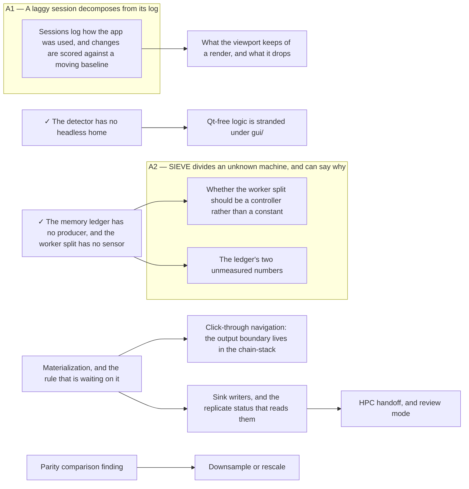

<!-- Generated by tools/doc_index.py. Do not edit; run `uv run nox -s docs`. -->

# Repo state — the one-read session primer

Every line here is derived; nothing is unique to this file. It exists
so a session orients in one read instead of four.

**Open items (8)** — one file each in `todo/`:

- [A filter never says what one element of its output means](todo/what-one-element-means.md) — nothing — `sieve detect --node` already mislabels today, and the CSV export ships the mislabelling to disk where it outlives the session
- [Sessions log how the app was used, and changes are scored against a moving baseline](todo/slow-path-surfacing.md) — nothing — the trigger fired 2026-07-28 when ledger-producers landed (docs/completed-todo/2026.07.28-ledger-producers.md): the resource probe and the pool meters now publish, so there is something to aggregate.
- [`slider_to_graph` names a gesture two other budgets now time](todo/slider-to-graph.md) — nothing — the trigger this item was written against ("a parameter control bound to a node") fired, and what is left is a decision about the budget table rather than a panel to build
- [Qt-free logic is stranded under gui/](todo/qt-free-logic-under-gui.md) — nothing structurally — but do headless-detection.md first, which moves the largest of these on its own terms
- [One edit is three regions in two files](todo/one-edit-is-three-regions-in-two-files.md) — nothing — scoped to option A on 2026-07-28 after 937ac91 refused option B
- [A GUI-saved pipeline must run identically in the CLI](todo/gui-cli-execution-parity.md) — nothing — AUTO-GUARDRAILS §2's own trigger ("the next item that touches serialization") fired with schema v3 and the check was never written
- [filter_tab.py is eleven jobs in one widget](todo/filter-tab-is-eleven-jobs.md) — nothing structurally — but take it one named responsibility per item, never as one split
- [A budget check gets slower the more of the suite pytest imported](todo/budget-checks-under-ambient-load.md) — nothing — but the first step is a measurement of the mechanism, not a choice among fixes; every option written before 2026-07-28 was written against a cause that turned out not to be the cause

**Deferred (19)** — the trigger is the whole line:

- [Tuning files: export and import the baseline](todo/tuning-files.md) — the first tuning somebody wants to apply to a second video — likely the parity-comparison finding, or the first multi-source experiment
- [The GUI holds the enumeration rule 3 forbids](todo/the-gui-holds-the-filter-enumeration.md) — the temporal chain becoming real nodes — two of the five enumerated steps have no filter module to be discovered *from*, so the enumeration cannot go before `Mode.WINDOWED` (docs/todo/kernel-protocol-beyond-one-frame.md); the parity comparison (docs/todo/parity-comparison-finding.md) frees the other three
- [Surrogate calibration for the detection threshold](todo/surrogate-calibration.md) — the temporal chain settling — concretely, the first parameter set somebody wants to run over a whole video and report
- [Sink writers, and the replicate status that reads them](todo/sink-writers.md) — the first filter that emits a TableSpec (a detector producing coordinates), or materialization landing and needing somewhere for a compacted array
- [What the viewport keeps of a render, and what it drops](todo/proxy-retention-policy.md) — a recorded session that scrubs, which is docs/todo/slow-path-surfacing.md's gesture mix to make visible. The capacity half landed 2026-07-28 in 14ce201: RENDER_RING_SHARE took fraction=0.01 against a 4 GB reserve — ~644 MB and so ~700 gray 1280-wide proxies on the finding's 68.4 GB machine, sized to reach a large machine's own knee rather than to hardcode the ~720 where that session saturated — and below ~26 GB total the 256 MB floor resolves instead, so a small machine pays nothing. What is left is the scrub half, and it has no sample: 16 scrub events, 0.00% hit under every policy. Reopening the eviction rule is a stall-length argument, not a throughput one, so it needs a recorded session that actually scrubs.
- [Process isolation for filter execution](todo/process-isolation.md) — a kernel that can take the process down rather than raise — most likely the first OpenCV-heavy filter or GPU work. Cooperative cancellation is the other trigger and the more likely one in practice: a full-video run the user wants to stop mid-frame cannot be interrupted in-process short of checking a flag between frames, which is fine until a single frame is slow.
- [Parity comparison finding](todo/parity-comparison-finding.md) — a seated session with the v1 checkout — v1 is a sibling repo no agent can reach and no headless run can drive, so the pending decision is what that session is for: a live two-GUI side-by-side, or one throwaway v1 run that dumps its count/gate series as a fixture a headless harness then compares against forever (recommended)
- [Materialization, and the rule that is waiting on it](todo/materialization.md) — a workload that can say what the general store's chunking is for — the replicate-crop half was split out 2026-07-28 (crop-artifact-writer / -serving / crop-boundary-gesture) and built the same day, so it no longer waits here; "filesystem is truth at rest" returned to the rules table with the writer, not with this one
- [The ledger's two unmeasured numbers](todo/ledger-measurements.md) — a floor reading on a *small* machine. The instrumented session ran 2026-07-28 (docs/findings/2026.07.28-the-session-floor-is-the-window.md) and changed the question: there is no machine-independent floor, session memory tracks the working window, and memory_reserve's fraction term therefore models the wrong variable — least wrongly on the largest machine and worst on the smallest. The load-bearing measurement is now one 30-second reading on ~8 GB hardware, which nobody has. H4 is answered only in the weak sense; the producers it was blocked on landed 2026-07-28 (docs/completed-todo/2026.07.28-ledger-producers.md), so what H4 now needs is a session read through them rather than a sensor.
- [A kernel protocol that is not one frame in, one frame out](todo/kernel-protocol-beyond-one-frame.md) — a filter that actually needs one — for `Mode.WINDOWED`, a filter needing a span before it can emit; for `rate_changing`, a decimator
- [HPC handoff, and review mode](todo/hpc-handoff-and-review-mode.md) — for HPC, a dataset that does not fit in a local session plus at least one sink — a real user with a real cluster, not a milestone; for review mode, the first durable output worth interpreting, which is the same trigger the deferred **Coverage and detection lanes** item has
- [GPU execution](todo/gpu-execution.md) — a filter whose CPU kernel is measurably the bottleneck of a tuning session — not merely slow, but one where `bench/budgets.py` is being missed because of it and the profile says so
- [Downsample or rescale](todo/downsample-or-rescale.md) — the parity-comparison finding landing — rescale is v1's semantic and must exist unchanged until the comparison has run; after it, this item decides whether rescale stays a first-class step or becomes a parity fixture
- [Coverage and detection lanes on the timeline](todo/coverage-and-detection-lanes.md) — the executor recording, per replicate and per frame, that it ran and under which resolved params
- [Click-through navigation: the output boundary lives in the chain-stack](todo/click-through-navigation.md) — general materialization promoting (docs/todo/materialization.md) — the source-boundary half left this item 2026-07-28 and shipped (docs/completed-todo/2026.07.28-crop-boundary-gesture.md), and what remains here is descent through *node* output boundaries, which has no writer until the general store exists
- [flow_direction, and whether a signal is a plane or a parameter](todo/block-signal-free-measures.md) — two decisions, both Kendrick's. (1) How a *circular* signal bands and renders — flow_direction is orthogonal to everything existing and is the screening's other survivor, but a value band and a heat ramp over an angle are wrap-around objects the GUI has no shape for. (2) Whether block_signal keeps emitting one plane chosen by a parameter or emits several at once — the screening promoted one measure, not the four that would have paid for the protocol change, so the case for it is now weaker than when this item was written and it should be reopened by a *second* survivor, not by this one. Recommendation for both in the body.
- [Application config, and where the boundary with Preferences falls](todo/application-config.md) — the first setting the CLI and the GUI both need to read — backend selection policy is the only live candidate, since cache bounds withdrew 2026-07-27 when the resource ledger made them derived rather than configured
- [Annotation spans, and the accuracy feedback they unlock](todo/annotation-spans.md) — a detector whose output is worth correcting by hand, or a labelling task that needs ground truth before one exists
- [Whether the worker split should be a controller rather than a constant](todo/adaptive-worker-allocation.md) — evidence that the fixed constants are wrong on machines that are not the reference — concretely, pool-utilisation samples from more than one class of machine showing the declared split leaving a pool starved or idle. The sensor landed 2026-07-28 (docs/completed-todo/2026.07.28-ledger-producers.md), so what is missing is no longer instrumentation but a second machine to point it at. A governor tuned on argument would oscillate where a fixed constant merely sits at the wrong value.

**Frontier (8 of 8)** — open items whose `after:`
prerequisites are all complete. `gated_on` is still the gate; this only says
no *other item* has to come first:

- [A filter never says what one element of its output means](todo/what-one-element-means.md)
- [Sessions log how the app was used, and changes are scored against a moving baseline](todo/slow-path-surfacing.md)
- [`slider_to_graph` names a gesture two other budgets now time](todo/slider-to-graph.md)
- [Qt-free logic is stranded under gui/](todo/qt-free-logic-under-gui.md)
- [One edit is three regions in two files](todo/one-edit-is-three-regions-in-two-files.md)
- [A GUI-saved pipeline must run identically in the CLI](todo/gui-cli-execution-parity.md)
- [filter_tab.py is eleven jobs in one widget](todo/filter-tab-is-eleven-jobs.md)
- [A budget check gets slower the more of the suite pytest imported](todo/budget-checks-under-ambient-load.md)

**Aspirations** — the long view (`ASPIRATIONS.md`), and what is walking
toward it. An aspiration with nothing under it is the point of this block:

- **A1 — A laggy session decomposes from its log**
  - [Sessions log how the app was used, and changes are scored against a moving baseline](todo/slow-path-surfacing.md) — open
- **A2 — SIEVE divides an unknown machine, and can say why**
  - [A budget check gets slower the more of the suite pytest imported](todo/budget-checks-under-ambient-load.md) — open
  - [Whether the worker split should be a controller rather than a constant](todo/adaptive-worker-allocation.md) — deferred
  - [The ledger's two unmeasured numbers](todo/ledger-measurements.md) — deferred
- **A3 — SIEVE navigates the parameter space itself**
  - [Annotation spans, and the accuracy feedback they unlock](todo/annotation-spans.md) — deferred
  - [Surrogate calibration for the detection threshold](todo/surrogate-calibration.md) — deferred

**The item DAG** — `after:` edges only; an arrow points from a
prerequisite to the item that waits on it. `✓` is complete. Items with no
edge are omitted, not missing — they are the lists above.

**Budgets:** 9 of 10 in-pipeline budgets have no CI benchmark asserting a limit.

**Last completed** (full list in `completed-todo/.index.md`):

- 2026-07-28 — The todo DAG exists, in prose, where nothing can read it
- 2026-07-28 — The decode format is a key input with six derivations
- 2026-07-28 — Record a tuning session, and score a retention policy against it

**Latest finding:**

- The worker optimum moves with core class, and a core count cannot say so — The prefetch optimum is not flat and it is not one number. Across worker counts the best reading varies 2.33x on performance cores and 2.11x on efficiency cores, so there is real gradient for a controller to act on — and the *location* of the optimum moves with core class: 2 workers on P-cores (7.96 ms/frame), 3 on E-cores (9.71) and 3 unpinned (9.04). More workers partly compensates for slower cores, which is why the P/E gap is 1.67x at one worker and only 1.22x at each side's own optimum. `resolve_workers` is denominated in `available_cpus()`, a count in which a P-core and an E-core are the same unit, so no value of `LUMA_WORKER_CAP` is right on both.
