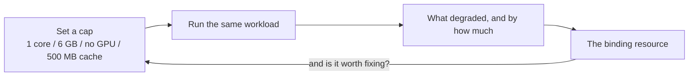
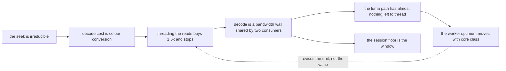

# The benchmark loop

A design, not a description. Most of the boxes below do not exist yet; every
one is marked, and the marks are the point — a diagram of this loop that did
not say which half was built would be the thing rule 6 forbids, drawn.

Read `docs/ARCHITECTURE.md` for the rules and `docs/todo/slow-path-surfacing.md`
for the item that is the loop's missing centre.

## What it is for

Three jobs, and they are not the same job. Stated as a reading of the intent,
because the loop is worth building for any one of them and they pull in
slightly different directions:

1. **The tool reports its own slowness, so nobody has to describe it.** A
   session that felt laggy leaves a record precise enough to act on, instead of
   arriving as "the graph was slow yesterday". This is the one that changes how
   the work gets done: the input to a session is a measurement rather than a
   memory.
2. **The user is told what is slow, where it comes from, and what to do.** Not
   a profiler — an explanation, at the moment and in the place the symptom
   appeared. Some causes are not fixable in code, and for those the honest
   product is the sentence, not a todo item.
3. **Constraint is an instrument.** Caps the user sets deliberately — one core,
   6 GB, no GPU, 500 MB of cache — are not only a courtesy to the machine. They
   are how a cause gets isolated: throttle one resource, see what degrades, and
   the thing that degrades is the thing that was binding.

Purpose 3 is the one that most needs saying out loud, because a settings panel
that exists only to be polite gets built differently from one that exists to
run experiments — the second has to record what it was set to, alongside every
measurement taken under it.

## The loop

```mermaid
flowchart TD
    subgraph declare["1 — What the machine is, and what it may use"]
        specs["Machine reading<br/>mutual/machine.py<br/>BUILT — cpus, memory, cpu_classes"]
        caps["User caps<br/>cores, RAM, cache bytes, GPU on/off<br/>NOT BUILT — todo/application-config.md"]
        shares["Declared shares<br/>mutual/shares.py<br/>BUILT — but denominated in a core count"]
        specs --> shares
        caps --> shares
    end

    subgraph measure["2 — Measure, under those constraints"]
        live["Live session sampling<br/>gui/resource_probe.py, bench/metrics.py<br/>BUILT — 1 Hz, judged against BUDGETS"]
        deliberate["Deliberate sweep<br/>cli/sweep_cmd.py, bench/sweep.py<br/>BUILT — core sets x workers"]
        shares --> live
        shares --> deliberate
    end

    subgraph record["3 — A file, not a feeling"]
        log["Session log<br/>bench/retention_trace.py is the shape<br/>PARTIAL — records scrubs, not the whole gesture mix"]
        live --> log
        deliberate --> log
    end

    subgraph judge["4 — What lagged, and against what"]
        baseline["Moving baseline + scoring<br/>NOT BUILT — todo/slow-path-surfacing.md"]
        graph["Findings graph<br/>which measurement explains which<br/>NOT BUILT — see below"]
        log --> baseline
        baseline --> graph
        graph --> baseline
    end

    subgraph act["5 — Two audiences, two products"]
        state["docs/.state.md flag<br/>PARTIAL — file is generated, has no slow-path section"]
        toast["In-app explanation<br/>what is slow, where from, what to do<br/>NOT BUILT"]
        baseline --> state
        baseline --> toast
    end

    item["A todo item<br/>docs/todo/*.md"]
    state --> item
    item -->|"fixed in code"| shares
    toast -->|"user changes caps or workload"| caps

    tinker["User tinkers; parameters move"]
    toast --> tinker
    item --> tinker
    tinker --> live
```

The branch at step 5 is the load-bearing one. **Fixable goes to a todo item;
not-fixable goes to the user as a sentence.** Collapsing them — routing
everything to a todo, or everything to a toast — is how the loop stops paying
for itself: a backlog of items nobody can act on, or a user told about a
regression they cannot influence.

## Constraint as an instrument

The caps in step 1 feed the measurement in step 2, which is what makes them an
experiment rather than a preference. The same file that says *don't use all my
RAM* is the file that says *use exactly one core, so I can see what that
costs*.



Two things this must not do, both already learned:

**A cap is not a budget and a budget is not a cap.** A budget attributes cost;
it never forbids work. `MAX_BLOCKS` was removed for exactly this — a
dev-machine number refusing a scientific choice
(`docs/completed-todo/2026.07.28-budgets-attribute-cost-they-do-not-cap-it.md`).
A user cap is the opposite: a declared refusal the tool must respect. They live
in different files and must never be resolved into one number.

**Every measurement carries the caps it was taken under.** A reading taken at
one core and a reading taken at sixteen are not comparable, and a log that
recorded only the number would make them look like a regression. This is the
same requirement `docs/todo/adaptive-worker-allocation.md` states for a
controller: publish the resolved split alongside every sample, or findings
taken under it are not comparable.

## The findings graph

The request is that the load-balancing findings become a graph so their
relations do not get re-derived. They currently do not have one:
`docs/todo/.index.md` has an `after:` DAG for *items*, and
`docs/findings/.index.md` is a flat table. So the same reasoning — bandwidth
binds, so a core count is the wrong knob — gets reconstructed from prose every
time.

What the edges would be, on the findings that exist today:



The dotted edge is the kind the flat index cannot express and the kind that
matters: a later finding that does not *overturn* an earlier one but changes
what its number is denominated in. `supersedes:` already exists in the
frontmatter and is the wrong relation for it — nothing was superseded.

A second field (`refines:` or `depends_on:`) generated into the index the same
way the item DAG already is would make this checkable rather than drawn. That
is the smallest version and it is where to start; a hand-maintained diagram of
findings would be stale within a week, which is the failure the generated
indexes exist to prevent.

## Honest state of the loop

| Step | Element | Status | Home |
|---|---|---|---|
| 1 | machine reading | built | `mutual/machine.py` |
| 1 | user caps (cores, RAM, cache, GPU) | not built | `docs/todo/application-config.md` (deferred) |
| 1 | declared shares | built, wrong unit | `mutual/shares.py`, see the core-class finding |
| 2 | live session sampling | built | `gui/resource_probe.py`, `bench/metrics.py` |
| 2 | deliberate sweep | built | `cli/sweep_cmd.py`, `bench/sweep.py` |
| 3 | session log | partial | `bench/retention_trace.py` — scrubs only |
| 4 | moving baseline, scoring | not built | `docs/todo/slow-path-surfacing.md` (open) |
| 4 | findings graph | not built | this file |
| 5 | `.state.md` slow flag | not built | `tools/doc_index.py` generates the file |
| 5 | in-app explanation | not built | rule 6's mirror: a toast must not out-claim its evidence |
| — | GPU as a togglable resource | not built | `docs/todo/gpu-execution.md` (deferred) |
| — | cache disk bound | not built | `mutual/shares.py` `UNBOUNDED`; needs materialization |

Five of thirteen are built. The missing centre is step 4: everything upstream
of it produces numbers, and nothing yet turns numbers into a claim about what
was slow.
