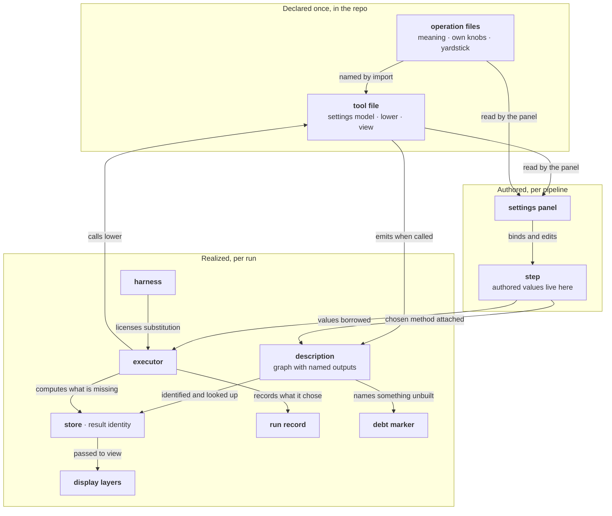

# PAR-0007 — The tool contract: what a tool owns, and what it must never own

Status: Proposed
Date: 2026-08-03

> The tool is the synthesis that eventually makes it to the user. It
> knows nothing. This is how I envisioned tools being: theres a GUI, a
> bunch of elegant back end stuff, ops, validation layers, and then the
> tool: the guest list that puts them all in the same room. It didn't
> give them names, it just wrote those names down. The tool is the
> facilitator, and the tool contract is quite literally the list of
> what it brings together. It owns the guest list, and the synthesis
> from the list is what eventually makes it to the GUI flagged in red
> for the user: who failed to show up, or showed up drunk. Because
> there are so many separate systems working together, a tool survives
> by exactly what it owns and nothing else: there are other subsystems
> that make other things work together, but the tool contract brings
> all the things that result in the ultimate value of SIEVE as a tool
> together in one place. Each can work on its own just fine: the
> contract is the only mechanism that explicitly states what the final
> deliverable is lacking, as judged by what was included in the tool's
> contract. It is the coherence check. That is why it is arguably the
> most important PAR: you define a tool by the things you want on it,
> and what it has, what it doesn't, and how good those things are tell
> you immediately where to make improvements.
>
> — Kendrick, 2026-08-03

The rest of this rationale is that statement made precise, and the one
thing it leaves out: the tool can be the coherence check *only*
because it holds no power over anyone on the list. A guest list that
could also cook the food could not tell you the caterer failed to show.
Every rule below is a power withheld, and the withholding is what makes
the list trustworthy.

## Outcomes

What this system looks like working as intended: someone who wants a
new filter writes one file, reads nothing first, and it lands. It shows
up in the picker, it can be placed on a pipeline, and if a piece it
asks for has not been built yet, running it stops with a message naming
exactly what is missing. That stop is the system working, not breaking.
What they wrote keeps being correct when the part of SIEVE that runs
things gets faster, because nothing they wrote said anything about
running. Adding a second way of computing an existing measurement is
also one file, and no existing file changes. And when someone catches
themselves editing something else to make their new filter work, they
know immediately what has gone wrong: some other part of SIEVE is
holding a piece of the filter that should have been in the filter.

This is the state after `docs/PLAN-TOOL-CONTRACT.md` Phase 2 settles
which names the kernel exposes. Until it does, a tool naming an unbuilt
operation fails at import rather than stopping at run time with the gap
named, so the central property above is an intention and not a report.

## Context

### The system this rationale owns

The boundary around a tool file: what may pass into it, what may pass
out of it, and what may never pass either way. What is on the far side
of that boundary belongs to other rationales — what an operation is and
what may be silently swapped for one (PAR-0005); what an operation
itself owns (PAR-0020); what the part of SIEVE that runs things does
with the description it gets (PAR-0008); how the settings panel and the
display are drawn (PAR-0013); how the settings format is versioned
(PAR-0016); how SIEVE decides which tools may be placed where
(PAR-0011); how two ways of computing something are measured against
each other (PAR-0012, PAR-0019); and where the tests that enforce all
of this live (PAR-0017).

### The occasion

The first design of this boundary was rejected, and not for being
wrong. It was coherent — tools written as small compilers, three
registries, dispatch on operation class (design session, Exchange 5) —
and Prompt 6 killed it: *"I suspect an agent would write spaghetti code
every time... Your solution makes extending the repo a headache for all
future edits."* That names two separate failures. One is letting a
component claim things about itself that nothing checks, which is
PAR-0005's problem. The other is *"it made every future contributor pay
compiler tax before shipping anything,"* and this rationale is where
that one is answered.

### The evidence

The arrangement at issue is not an invention of this repo. Stated
plainly: **the person who adds a capability writes only a description
of what to compute; running it, drawing it, registering it, and making
it fast belong to other parts of the system.** That arrangement has a
long track record, in four kinds — including the kind that argues
against it. Each case is given with what transfers here and what does
not, because a system cited without that is decoration.

**It worked, and the payoff is the one SIEVE is counting on.** In SQL
databases a query describes the result and says nothing about how to
get it, which is why queries written twenty years ago kept getting
faster as the database improved underneath them, unedited — and why the
database can recognise two requests as the same computation at all,
which is the same trick SIEVE uses to know a result is already
computed. In LLVM, a new programming language ships by writing only a
front end that emits a description; Rust, Swift and Julia all did
exactly that, and every later optimisation and every new chip arrived
for all of them without a single front-end edit. Nearest to this
repo's own work, the scientific workflow engines (Snakemake, Nextflow)
let a rule declare its inputs, outputs and command while the engine
owns scheduling and caching — which is the only reason restarting a
half-finished pipeline without recomputing everything is possible.
*Transfers:* the payoff itself. A filter written this year keeps
producing valid, already-cached results when SIEVE later learns to fuse
or reorder work (PAR-0008, PAR-0009). *Does not transfer:* their
machinery. Adopting this arrangement does not mean building a query
planner or an optimisation framework; at two tools that would be the
same mistake the rejected first design made. **What is being adopted is
an absence of wires, not a planner.**

**It was adopted and it failed, twice, in different ways.**
TensorFlow 1.x made users build a description in a second vocabulary
and then run it, so errors appeared far from the line that caused them
and ordinary debugging did not work; it lost to PyTorch, where code
simply runs, and Google abandoned the design in TensorFlow 2. Maven
went the other way: its description language could not express what
real builds needed, so authors either smuggled the work back in through
opaque plugins or left for a tool that let them write steps directly.
*Transfers:* both, as the two ways this can be got wrong. TensorFlow's
lesson is that the arrangement fails when the *author* feels it — which
is Prompt 6's objection, arrived at independently, and the reason a
tool here is ordinary code returning a small value rather than a
program in a second language. Maven's lesson is that it fails when the
vocabulary is too poor to say what people need — and SIEVE's answer is
that naming something that does not exist yet is allowed: the tool
lands and the gap is recorded as debt, so a missing word is queued work
instead of a wall. *Does not transfer:* the conclusion that describing
first is simply dead. PyTorch adopted the same arrangement underneath
itself the moment it wanted speed, and SIEVE's need for responsiveness
is answered inside the description — a preview is the same recipe with
two steps added in front — rather than by letting tools run things.

**It was refused, and the refusal caused exactly the failures predicted
here.** ImageJ, the dominant image-analysis program in biology, lets
each plugin own its own dialog, its own loop and its own file access.
The consequences are well known to anyone who has tried: running it
without a screen is a struggle, plugins do not combine, and the record
of what was done is a macro that replays button presses. Its successor
had to rebuild the entire plugin system around declared parameters to
get batch processing and provenance at all. *Transfers, with a caveat
that matters:* ImageJ succeeded enormously for twenty-five years of
interactive, one-person work. What it could not do is precisely what
SIEVE promises — unattended batch runs, composition, and a trustworthy
record of what produced a number. The second exhibit is this project's
own v1 (`antscihub-optical-flow-detector`): with no boundary, facts
that change answers had nowhere to live. A 10× accuracy difference
(0.364 vs 3.80 RMS grey-levels) came from the order of operations
inside an implementation and survived only as a comment; a block size
had to be kept in step with a downsample factor by hand; and the choice
between optical-flow methods that answer differently sat in ambient
configuration. v1 works, and every one of those is a path to a quietly
wrong number that this boundary makes impossible to write.

**It was refused, and those systems succeeded anyway.** Unix pipes run
every tool immediately, plan nothing and cache nothing, and remain one
of the most successful ways of combining programs ever built.
scikit-learn's models compute directly when called, with no description
anywhere, and it is the most used machine-learning library in the
world. *Why that does not transfer:* nothing downstream of them wants
the description. They keep no store of results named by what computed
them, they never substitute one implementation for another behind the
user's back, and recomputing is cheap enough to be part of normal work.
This is the honest boundary of the whole argument — **the arrangement
is not good practice in general.** It becomes forced only when a system
commits to storing results under names derived from how they were
computed (PAR-0009), to improving execution independently of the
analyses people already wrote (PAR-0008), to substituting equivalent
implementations without telling anyone (PAR-0011, PAR-0012), or to
accepting contributions from more authors than it can review — here
including agents. SIEVE's stated outcomes commit it to all four. The
boundary is not a matter of taste; it is the bill for commitments made
elsewhere.

### What is settled now, with no tools yet in existence

The cost of getting this boundary wrong is lopsided in time, and that
is what licenses settling it before any tool exists. PAR-0005 states
the pattern for what a tool returns: free to change today, a rewrite of
every tool at any later moment. The same holds for anything else a tool
must accept or produce. So this rationale contains exactly the claims
whose cost of being wrong later is a rewrite or a migration of stored
results, and nothing else. Everything further about what a tool
contains waits for real tools to argue against, because a rationale
cannot settle an empty room and should not pretend to.

### Primaries

`docs/archive/SESSION-2026-08-03-tool-contract-scope.md` — the sitting
that scoped this rationale: how the required surface had grown from
three parts to five (Exchange 1); the adversarial pass and what it
killed (2); the admission filter above (4); the name `lower` challenged
and kept (5); the Tool as the only thing with a contract (6); what
`lower` receives, and handles that expose properties but never history
(7); configuration interchange growing out of this rationale (8); where
the one-file rule came from (9); its reinterpretation as a detector,
the sitting's central result (10); where a method's settings live (11).

`docs/archive/SESSION-2026-08-03-par-0007-hardening.md` — the sitting
that rewrote this rationale in plain language, gathered the evidence
above, settled the boundary as a membrane, walked the system end to end,
and split the operation contract out into PAR-0020.

## Decision

### What "owns" means here, since almost nothing is owned

A part of SIEVE **owns** something when it is answerable for it and may
change it. That is a narrow relation, and by it a tool owns very
little. It does not own its own settings fields in any strong sense: it
cannot invent a field type, because those are a closed vocabulary the
display dispatches on; it cannot decide whether something is even
allowed to be a setting, because PAR-0006 decides that; it cannot
rename a field freely, because the name is part of how results are
identified and old names are never reused (PAR-0016); and it cannot
withdraw a field, because every stored result pins the definition that
produced it. What it does is **declare**, which is an act performed
under rules held elsewhere.

Three verbs, used deliberately and never interchanged:

- The tool and the operation each **declare** one half of the settings
  surface.
- Values **live in** the pipeline file, as part of a step. Nothing
  "owns" them, because a value is not a responsibility.
- The tool alone **interprets** those values — it is the only part of
  SIEVE that knows what `threshold = 0.7` means.

**A tool owns the translation of the settings someone authored into a
description of what should be computed, and it owns what its own
settings mean. It owns nothing else.** Everything below is that
sentence applied to one particular thing a tool might otherwise reach
for, and each is written as a missing wire rather than as a rule,
because a wire that does not exist cannot be grabbed, while a rule can
only be obeyed.

The word *contract* in this rationale means one thing: the small fixed
shape a tool file has — its settings model (`Params`), its translation
function (`lower`), and its display function (`view`). The boundary is
not the contract; the contract is how the boundary is held.

### It does not run anything

Both of a tool's functions are pure. `lower` turns settings into a
description; `view` turns one computed value into a display. Neither
gets a handle on the part of SIEVE that runs things, neither is given a
context object or a callback, neither reads or writes files, and
neither keeps state anywhere but in its own settings. This is the
strongest lever the design has against an agent writing tangled code,
and it is why the list of available tools is derived by scanning the
tools package rather than maintained by hand. The absence is fixed
now, while there are no tools, because removing a handle after twenty
tools have taken one is twenty rewrites.

### It cannot see the application's own settings

There is no preferences argument. The design session's Prompt 2 asked
for a step that "also takes SIEVE preferences," and the rebuilt design
has none; PAR-0006 treats that absence as the mechanism that keeps
application settings out of results, not as an oversight. A preference
cannot reach a number because there is no channel to carry it — which
also makes it testable: scramble every preference, and `lower` must
return exactly the same description (PAR-0017).

### It cannot see what it is attached to, beyond what the values are

`lower(self, p, inputs)` receives the values coming from upstream, and
they are typed and non-inspectable.

Typed, because SIEVE must be able to answer "can this tool go here?"
from the tool's class alone, before any settings are filled in — an
ineligible tool is shown greyed *with the missing requirement named*
(design session, Exchange 6, condition 3), and that has to be readable
without running anything.

Non-inspectable, because a tool that can look at where its input came
from and emit something different is doing the job of the part of SIEVE
that plans work — which belongs to PAR-0008 alone, and is precisely
what an agent writes when asked to make a tool efficient. The line that
keeps both true: **a handle tells you what the value is — its size, its
frame rate, its data type — and never how it was made.** A frequency
bank capped at `0.45 × fps` stays writable, exactly as v1 writes it;
"the thing above me is already a resample, so I will skip mine" cannot
be written at all, because there is no history to branch on.

A declared list of what a tool consumes was considered and rejected,
and the reason is narrower than this design's usual case against
declarations. The three declarations rejected earlier were each a
second copy of a fact that already existed elsewhere with nothing
checking the copy, and a declaration is only dangerous when it can
disagree with something — against a `lower` that received nothing, such
a list would disagree with nothing. It is ruled out on different
grounds: what a function accepts is the thing that cannot be changed
later, and a declaration is. Adding an argument after tools exist
rewrites every tool; adding a declaration later adds to them.

### It does not decide the shape of what it produces

`lower` returns a graph with named outputs, not a single operation. The
forcing case is settled in the design session (Exchange 2): a tracker
offers centre-of-mass trajectories *and* segmentation masks as two
named outputs, both always present, with the user choosing which to
connect. A tool that can produce two logical results cannot return one.
A single operation is simply the one-node case. `view(self, p, out)`
taking one output value is the same settlement seen from the other
side: displays are per-value, so they combine with named outputs for
free.

That graph may also contain a point where a choice made by the user is
attached later — when a measurement offers more than one method, the
chosen one is joined to the description outside the tool, because the
tool never learns which was chosen. That such an attachment point may
exist is part of what `lower` returns and therefore belongs here; how
the joining is performed belongs to PAR-0014, and is ordinary machinery
that can be settled whenever that rationale is written.

### It does not own the meaning of the operations it names

Operations live outside the tool's file. A tool is usually the
*occasion* for an operation — most operations get built because some
tool needed one — but the operation is a different file because it is
different debt, with its own marker and its own governing rationale.
This is the one mistake here that is paid in data rather than code: an
operation living inside a tool file has its identity tied to that
file's location, and moving it out later changes the names under which
results were stored, orphaning them. What an operation itself owns is
PAR-0020's; this rationale states only the refusal, and the same rule
is deliberately stated in both places for different reasons — here it
is a wire that does not exist, there it is a requirement of identity.

What does cross into the tool is the vocabulary itself: a tool imports
operation *names* in order to build its description. **The tool speaks
the vocabulary; it neither defines it nor knows what any word costs.**
Naming a word that does not exist yet is allowed, and is the ordinary
way a gap gets recorded (PAR-0002).

For the same reason a tool never states that anything is equivalent to
anything: equivalence is earned by measurement at the harness, which is
the only party that decides. What a tool's output *means* — the
comparator, how close is close enough, which statistic must survive —
is genuinely the tool's to say, and PAR-0012 is where that declaration
lands, beside the measurement that consumes it. It is not settled here
because a declaration can be added to a tool later without touching any
tool that already exists, which is the same ground on which a declared
list of inputs was refused above. The companion convention PAR-0005
routed here — that a tool declares which guarantees it gives up — is
declined outright, and its own first instance refutes it: what an
opaque operation gives up is already derivable from its form, so
declaring it would be a second unchecked copy of what the value
carries. What is *not* derivable is what that loss means for the user,
which is worked out when SIEVE chooses an implementation (PAR-0011) and
shown by the display (PAR-0013).

### It does not own the method

A tool's settings hold what is true of the measurement however it is
computed — how big, how long, how sensitive. A method's own knobs live
with the method, in the method's file, and never beside them. The test
is whether the field would mean anything to a different implementation
of the same measurement: a time window would; a particular
implementation's speed preset would not. This is not a division inside
the tool's settings model — there is nothing to divide, because those
fields were never in it. No tool has a method choice today, so adopting
the rule costs nothing; what makes it worth settling now is the
reversal, since a knob in the wrong file is a schema migration plus a
changed hash for every result that used it (PAR-0006's pricing). It
also removed a rule
rather than adding one: PAR-0006 once had to exclude inert fields from
the identity of a result, and with method fields living on methods no
inert field survives to be excluded.

Two different things get called a *method*, and they behave oppositely.
Two implementations that produce statistically equivalent output are
two implementations of **one operation**: the user never learns which
ran, the identity of the result does not change, and the choice between
them is made by measured cost. Two methods that answer differently are
**two operations**: different descriptions, different numbers, and the
choice is authored and recorded — which is what PAR-0006 already ruled
for Farneback, DIS and RAFT. Both arrive as one file, and in neither
case is anything added to a tool, because a line registering a method
with a tool would be the tool holding knowledge about that method. The
rule itself is PAR-0020's; what matters here is the consequence, that
nothing is ever appended to a tool.

### How a violation announces itself

If adding a tool ever requires editing something that already exists,
then some other part of SIEVE is holding a piece of the tool — the
display knowing which tool it is drawing, a list holding registrations
that should have been derived, the running machinery holding
per-tool knowledge. That is what the one-file property in
`ARCHITECTURE.md` detects, and this rationale is why that property is
true rather than merely asserted. Read as a promise that a tool *works*
after one file, it is false. Read as a detector, it is exact: a tool
naming something that does not exist still lands, and stops at run time
with the gap named. The diagnostic when it fires is a question — what
does the file I just edited own that belongs to the tool?

### The whole boundary, in one picture

Two ways to read it. Follow the arrows for the flow of work; read the
labels for who does the work. **Every arrow touching the tool is
performed by something else** — the panel reads its declarations, the
executor calls it. That is the whole of this rationale in one property:
the tool performs nothing, and is therefore incapable of surprising
anyone.

## Consequences

- Acceptance amends `ARCHITECTURE.md` in the same commit:
  - Invariant 1 keeps its wording, and its citation moves from
    `archive/PLAN.md` Phase 1 decision 2 to this rationale, which
    supplies the reason it holds.
  - The "Tools" section's Exchange 5 citation moves here, and its
    example gains `lower`'s inputs argument.
  - **The GUI section's false narrowing is struck.** It says the
    settings panel is "generated by walking the tool's `Params`" — the
    tool's alone — which this rationale's ruling on where method
    settings live makes wrong. Only the narrowing is removed: the panel
    is generated from the declared settings, without tier 1 saying
    whose. What replaces it is PAR-0013's to rule, and shipping that
    rule under this rationale's acceptance would land an unwritten
    rationale's decision in tier 1.
  - The run diagram gains the chosen method being attached between the
    pipeline and the description. Its arrows are deliberately *not*
    labelled with who performs them: that is what this rationale's own
    figure is for, and duplicating it into tier 1 would make two
    documents agree edge for edge forever.
  - The Step and Task definitions enter the components section —
    a Step is a tool placed in the pipeline with its settings filled
    in, a Task is one execution built by SIEVE and authored by nobody,
    and neither is anything an author implements. The naming is
    Exchange 2's and is already cited there; what tier 1 lacks is the
    statement that only the Tool has a contract.
  - Its `Tools` example and `src/sieve/tools/base.py` both carry
    `lower(self, p)`. The base's docstring calls its signatures
    quotations from the settled record, so acceptance makes that
    quotation false: marker `20260802T023508Z` is amended to the
    three-argument form and cites this rationale in place of
    Exchange 5, with `DEBT-AUTO.md` regenerated in the same commit.
  - `README.md`'s "Where contracts live" moves from Exchange 1 to here.
- PAR-0020 receives what an operation itself owns — its own settings,
  when two implementations are one operation rather than two, the
  yardstick for membership, and that an operation declares field types
  and never how they are drawn. This rationale keeps only the
  tool-side refusals, and the placement rule is deliberately stated in
  both.
- PAR-0005 amends the consequence that routes the voiding declaration
  here (its marker, `20260803T072354Z`), or the refusal above falls. Its
  routing of "the equivalence spec" also splits: what counts as the
  same operation is PAR-0020's, what a tool's output means stays here.
- PAR-0006 was amended as ruled here and accepted 2026-08-03 (stamp
  `20260803T072355Z` discharged). PAR-0006 decides whether a setting
  affects results; this rationale decides where it lives.
- PAR-0002 settles the placeholder-form split (stamp `20260803T072353Z`,
  discharged at the sitting that stated it): a name a tool must be able
  to import has to raise when used, not when imported. What remains is
  an unsettled surface rather than a missing rule — which names the
  kernel exposes is `docs/PLAN-TOOL-CONTRACT.md` Phase 2's question —
  so until that lands, a tool naming an unbuilt operation still fails at
  import rather than at run time.
- PAR-0008 receives the obligation implied by the evidence above: a
  failure must be traceable back to the step that caused it. It builds
  the description from the steps and therefore holds that mapping by
  construction, through fusion.
- PAR-0009 identifies a result by the tool's settings, the chosen
  operation's identity, and that operation's settings.
- PAR-0011 owns grouping implementations by what they compute, with
  membership earned, and what a lost guarantee means for the user.
- PAR-0012 owns substitutions the user never sees; PAR-0019 owns
  equivalences the user is offered and chooses between. PAR-0012 also
  receives the yardstick surface itself — the comparator, tolerance and
  target statistic a tool suggests for the operations it emits — which
  PAR-0005 routed here and this rationale declines to settle, since a
  declaration added later touches no tool that already exists. What
  stays here is only the denial: a tool never returns a verdict.
- PAR-0013 receives the settings panel combining the tool's settings
  with the chosen operation's, and the rendering of gaps: a value that
  is missing or invalid is drawn as such. Absence belongs to the slot
  that would have held the value, never to the display layers
  themselves, so the layer vocabulary stays closed. What this rationale
  guarantees is only that the tool's declarations make the gap
  computable without the tool asserting anything about itself.
- PAR-0014 owns how a chosen method is attached to the description; the
  citation runs both ways.
- PAR-0017 receives two tests: the preference scramble, and a check
  that no tool file reaches the running machinery, the store, or the
  filesystem.
- `docs/PLAN-TOOL-CONTRACT.md` Phase 3's gate is narrowed rather than
  answered. Its first decision is *constrained* here, not settled: a
  declared list of inputs is ruled out and the inputs are typed, but
  the bridge from a tool to the dispatch table is not supplied, so
  `DEFERRED.md`'s entry stands and the gate stays open. Its fourth must
  land in tests rather than in a base class that merely withholds.
- Every bullet above that hands a ruling to another rationale is a
  bequest, and provisional. The receiving rationale may refuse it on
  evidence this one did not have, and a refusal amends this rationale
  rather than being overridden by it. Bequests to stubs are questions
  those stubs will settle, never rulings they inherit — twelve of the
  records named above are stubs and cannot answer back yet.
- The how-to layer gains three guides — writing a tool; adding a second
  method to an existing measurement; suggesting a yardstick for an
  operation — **as the surfaces they describe land**, not at
  acceptance. None can be followed today: the first depends on the
  kernel's names, the second on the harness and the settings panel, and
  the third has no reader until the harness exists. A guide for
  something that cannot be done is fiction in the layer that is read
  first.

## Challenges

*Agent-raised except where noted; none human-confirmed yet (PAR-0001:
friction is stated, never inferred).*

- **2026-08-03 — the Outcomes describe something the tree cannot do
  yet.** The whole rationale rests on a tool landing against operations
  that do not exist. The rule permitting it is settled, but the kernel
  still fails at import until Phase 2 settles which names it exposes.
  Narrowed 2026-08-03 from a missing rule to a pending surface; the
  central property remains an intention, and the detector this
  rationale offers has never fired on anything.
- **2026-08-03 — non-inspectable handles are asserted, not designed.**
  "What it is, never how it was made" is a clean line in prose. Nothing
  here says what makes it hold — whether a handle is a distinct type
  that withholds history, whether history is simply absent, or whether
  it is convention. If a tool can reach history by any route, the
  failure this guards against is available again.
- **2026-08-03 — the method distinction leans on an unbuilt system.**
  Whether two implementations are one operation or two is the axis on
  which method settings, grouping and user visibility all turn.
  Membership is earned by measurement, and the harness that measures is
  deferred. Until it exists the distinction is made by judgment, which
  is the thing this design otherwise refuses.
- **2026-08-03 — the boundary is designed against one shape of tool.**
  Cropping and downsampling are both simple coordinate maps with scalar
  settings and a single output. Neither exercises multiple outputs, a
  second input, a method choice, or a yardstick. The design's own rule
  is that an abstraction is designed with two examples in hand; on the
  page there are two, and in shape there is one.
- **2026-08-03 — purity is a property of behavior and the proposed
  check is static.** Nothing stops a tool importing a video library and
  reading a file inside `lower`. An import check catches the obvious
  case and not the determined one, and this rationale should not be
  read as claiming more.
- **2026-08-03 — the TensorFlow lesson is only half answered.** The
  evidence above says the arrangement fails when the author feels it,
  and this rationale answers the *authoring* half: a tool is ordinary
  code, and a missing piece stops with its debt named. The *running*
  half is untouched. Debugging a described computation is intrinsically
  harder than debugging code that just runs, because the failure
  surfaces inside machinery the author never wrote, and nothing here or
  in PAR-0008 yet designs what that looks like from the author's side.
  TensorFlow 1.x died on exactly that surface.
